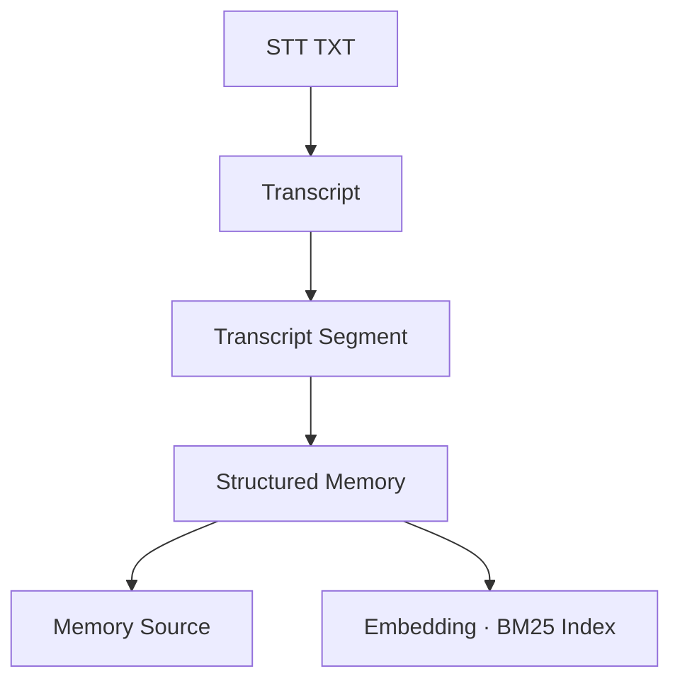
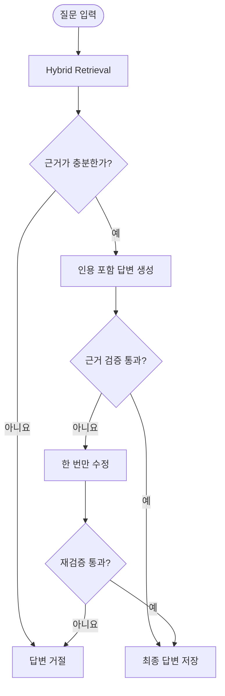
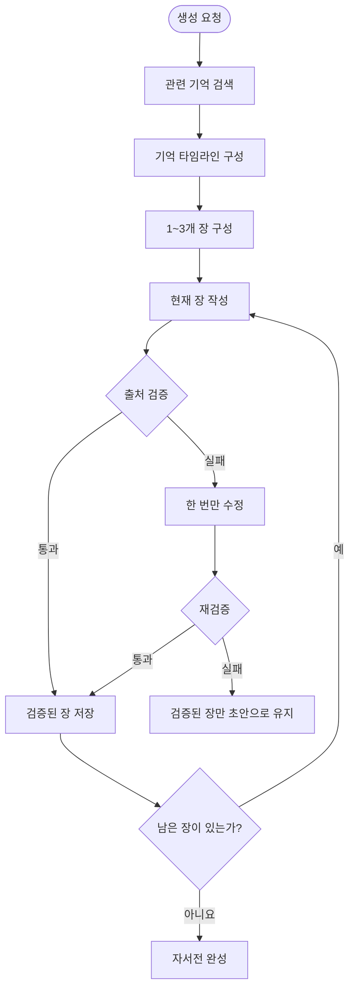

# 기억함 (Life Archive AI)

> 흩어져 있는 삶의 이야기를 검색 가능한 기억으로 정리하는 AI 기억 저장소

사람의 기억은 생각보다 흐릿합니다. 정확한 날짜는 잘 떠오르지 않고, 사건의 순서가 뒤섞이기도 합니다.
“초등학교 때였나?”, “친구랑 공원에 갔던 것 같은데”처럼 어렴풋한 장면이나 말로 남는 경우가 더 많습니다.

**기억함**은 이렇게 대화 속에 흩어져 있는 삶의 이야기를 하나씩 정리해 저장하는 Memory-Centric RAG 프로젝트입니다. 저장된 기억은 나중에 질문으로 다시 찾아볼 수 있고, 시간순으로 모아 타임라인을 만들거나 자서전 형태로 이어볼 수도 있습니다.

- 답변을 만들 때는 저장된 대화에서 확인할 수 있는 내용만 사용합니다. 
- 어떤 대화의 어느 부분을 바탕으로 만든 결과인지 출처를 함께 보여줍니다. 
- 기록에서 확인되지 않는 내용은 추측해서 채우지 않고 답할 만한 근거가 없다면 모른다고 답합니다.

## 1. 프로젝트 개요

기존의 문서 기반 RAG는 문서에서 질문과 관련된 내용을 찾아 답변하는 데 초점을 둡니다. 반면 기억함은 사람의 대화에서 의미 있는 사건을 찾아내고, 이를 하나의 기억 단위로 정리해 계속 쌓아가는 데 초점을 둡니다.

TXT 형식의 STT 대화 기록을 업로드하면 다음 과정을 거칩니다.

1. 원본 TXT를 변경하지 않고 저장합니다.
2. 텍스트를 정규화하고 출처 위치를 유지한 채 청크로 나눕니다.
3. 인물, 장소, 날짜, 감정이 포함된 구조화된 기억을 추출합니다.
4. 기억의 원본 정보는 SQLite에 저장합니다.
5. 검색을 위한 임베딩은 ChromaDB에 저장합니다.
6. 저장된 기억을 이용해 질문 답변, 타임라인, 자서전을 생성합니다.

### 프로젝트의 핵심 원칙

* 원본 TXT는 업로드 후 수정하지 않습니다.
* SQLite를 데이터의 기준 저장소로 사용합니다.
* ChromaDB와 BM25는 언제든 다시 만들 수 있는 검색 인덱스로 사용합니다.
* AI가 만든 답변과 글에는 원본 출처를 표시합니다.
* 정확하지 않은 날짜와 정보는 추측하지 않습니다.
* 근거가 부족한 질문에는 억지로 답변하지 않습니다.

## 2. 시스템 아키텍처


시스템은 크게 네 부분으로 구성됩니다.

* **Streamlit**: 사용자가 TXT를 업로드하고 결과를 확인하는 화면
* **FastAPI**: 요청 검증과 서비스 호출을 담당하는 백엔드 API
* **SQLite**: 대화 기록, 구조화 기억, 출처, 대화 내역, 자서전을 저장하는 기준 데이터베이스
* **ChromaDB·BM25**: 관련 기억을 찾기 위한 검색 인덱스

타임라인은 LLM을 사용하지 않고 SQLite 데이터를 날짜 기준으로 정렬하는 일반 Python 서비스입니다. LangGraph는 근거 기반 질문 답변과 자서전 생성에만 사용합니다.

## 3. 기술 스택

| 구분               | 기술                     | 사용 목적                     |
| ---------------- | ---------------------- | ------------------------- |
| Language         | Python 3.13            | 전체 애플리케이션 구현              |
| Frontend         | Streamlit              | TXT 업로드, 채팅, 타임라인, 자서전 UI |
| Backend          | FastAPI, Uvicorn       | REST API 및 요청 검증          |
| LLM              | OpenAI API             | 기억 추출, 답변 및 자서전 생성        |
| AI Framework     | LangChain              | 프롬프트, 모델, Retriever 연결    |
| Workflow         | LangGraph              | QA와 자서전의 상태 기반 실행 흐름      |
| Database         | SQLite                 | 원본 및 비즈니스 데이터 저장          |
| Vector Store     | ChromaDB               | 의미 기반 기억 검색               |
| Sparse Retrieval | BM25                   | 단어 및 문자 기반 검색             |
| Rank Fusion      | Reciprocal Rank Fusion | 의미 검색과 BM25 결과 결합         |
| Validation       | Pydantic v2            | API 및 모델 출력 검증            |
| HTTP Client      | HTTPX                  | Streamlit과 FastAPI 통신     |
| Testing          | pytest                 | 서비스, API, UI 테스트          |


## 4. 데이터 개요

기억함은 원본 대화 기록과 AI가 추출한 기억을 분리해서 관리합니다.

### 데이터 처리 과정



### 주요 데이터

| 데이터                | 설명                    |
| ------------------ | --------------------- |
| Transcript         | 업로드된 원본 및 정규화된 대화 기록  |
| Transcript Segment | 출처 위치를 유지하면서 분할한 텍스트  |
| Memory             | 대화에서 추출한 사건 단위의 기억    |
| Memory Source      | 기억과 원본 대화 위치를 연결하는 정보 |
| Conversation       | 사용자 질문과 검증된 답변 기록     |
| Autobiography      | 생성 중인 초안 또는 완성된 자서전   |

구조화된 기억은 다음과 같은 정보를 가집니다.

```json
{
  "memory_id": "mem_001",
  "title": "친구와 공원에서 만난 날",
  "summary": "오랜만에 친구를 만나 공원에서 이야기를 나눴다.",
  "people": ["친구"],
  "location": "공원",
  "event_date": "2020",
  "date_precision": "year",
  "emotion": "반가움",
  "confidence": 0.9,
  "uncertainty_notes": null
}
```

날짜가 정확하지 않다면 없는 월이나 일을 임의로 채우지 않습니다. 날짜를 알 수 없는 기억은 타임라인에서 별도의 `undated_events`로 반환합니다.

원본 출처는 다음 정보로 추적합니다.

```text
memory_id
transcript_id
segment_id
start_offset
end_offset
```

## 5. 에이전트 흐름도

### 근거 기반 질문 답변



질문 답변 에이전트는 다음 원칙을 따릅니다.

* ChromaDB 의미 검색과 BM25 검색 결과를 RRF로 결합합니다.
* 선택된 기억에 포함되지 않은 `memory_id`는 인용할 수 없습니다.
* 생성된 주장마다 하나 이상의 기억 출처가 필요합니다.
* 검증 실패 시 답변을 한 번만 수정합니다.
* 재검증도 실패하면 생성된 초안을 사용자에게 반환하지 않습니다.

### 자서전 생성



각 문단에는 내용을 뒷받침하는 `memory_id`가 포함됩니다. 검증을 통과한 장은 즉시 SQLite에 저장되며, 모든 장이 검증됐을 때만 상태가 `completed`로 변경됩니다.

## 6. 기능 명세서

| 기능        | 설명                        | 입력                  | 출력              | API                                |
| --------- | ------------------------- | ------------------- | --------------- | ---------------------------------- |
| 서버 상태 확인  | 백엔드 실행 상태 확인              | 없음                  | 상태, 서비스명, 버전    | `GET /api/v1/health`               |
| TXT 업로드   | STT TXT를 저장하고 기억 추출·색인 수행 | TXT, 언어, 녹음일        | 세그먼트·기억·색인 개수   | `POST /api/v1/memories/ingest`     |
| 중복 업로드 방지 | 같은 파일명 또는 같은 내용의 재업로드 차단  | TXT                 | HTTP 409 오류     | 업로드 API에 포함                        |
| 기억 목록 조회  | 저장된 활성 기억과 원본 출처 조회       | 선택적 `transcript_id` | 기억 및 인용 목록      | `GET /api/v1/memories`             |
| 근거 기반 채팅  | 관련 기억만 사용해 질문에 답변         | 질문, 세션 ID, Top-K    | 답변, 인용, 검증 결과   | `POST /api/v1/chat`                |
| 타임라인 생성   | 기억을 날짜순으로 정렬              | 시작일, 종료일            | 날짜 기억, 날짜 미상 기억 | `POST /api/v1/timeline`            |
| 자서전 생성    | 관련 기억으로 최대 3개 장 생성        | 제목, 요청, 주제, 기간      | 초안 또는 완성 자서전    | `POST /api/v1/autobiographies`     |
| 자서전 조회    | 저장된 자서전 다시 조회             | 자서전 ID              | 저장된 자서전         | `GET /api/v1/autobiographies/{id}` |

### Streamlit 화면

| 화면      | 주요 기능                |
| ------- | -------------------- |
| TXT 업로드 | 대화 기록 업로드 및 처리 결과 확인 |
| 구조화 기억  | 추출된 기억과 출처 확인        |
| 기억 채팅   | 저장된 기억에 관한 질문        |
| 타임라인    | 날짜별 기억 조회            |
| 자서전     | 기간과 주제를 지정해 자서전 생성   |


