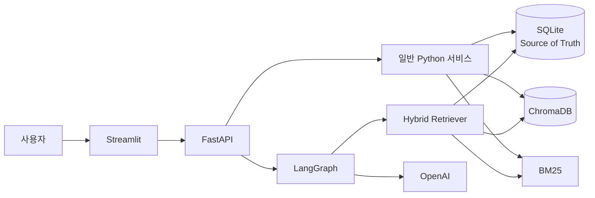
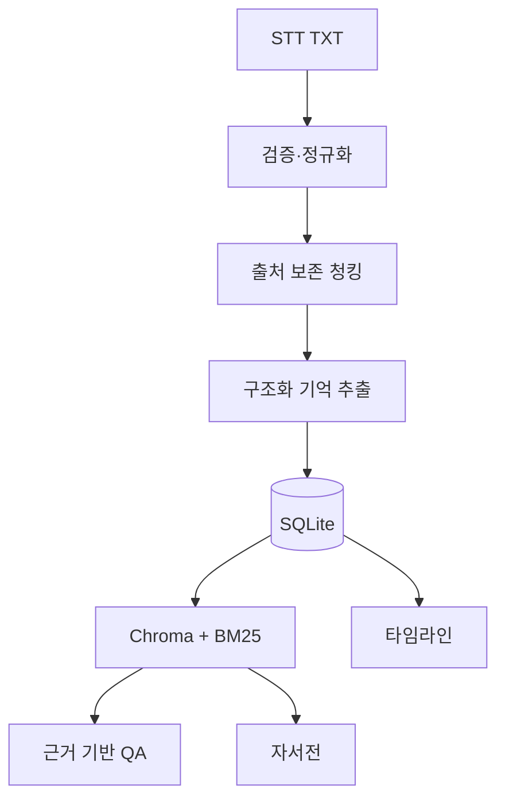
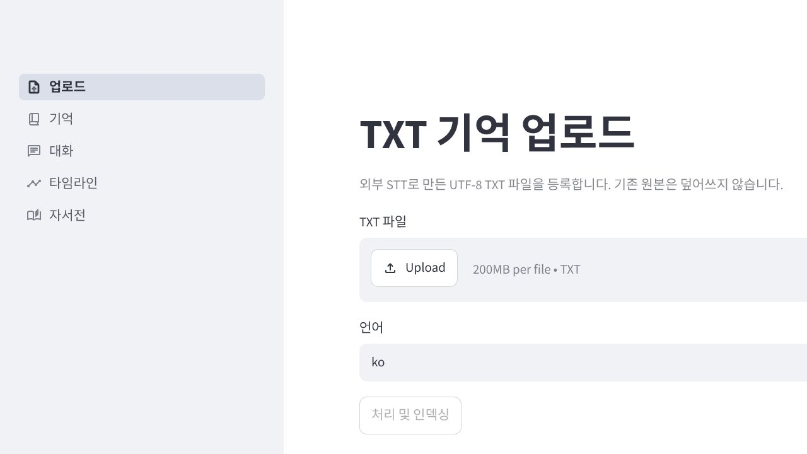
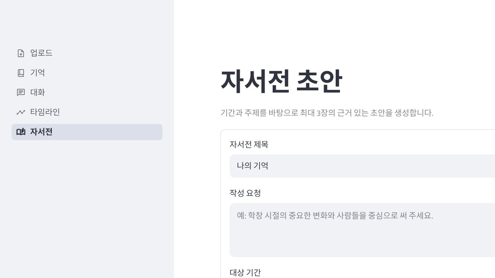

# 기억함 (Life Archive AI)

> 흩어진 삶의 이야기를 검색 가능한 장기 기억으로 정리하는 Memory-Centric RAG

사람의 기억은 날짜와 순서가 흐릿하고, 대화 속 여러 장소에 흩어져
있습니다. 일반적인 문서 검색형 RAG는 관련 문장을 찾는 데 집중하지만,
기억함은 STT 대화 기록에서 사건을 구조화하여 지속적으로 검색할 수 있는
기억 저장소를 만드는 데 초점을 둡니다.

기억함은 외부 STT로 만든 UTF-8 TXT를 입력받아 인물, 장소, 날짜, 감정,
불확실성과 원문 위치를 가진 기억으로 변환합니다. 질문 답변, 타임라인,
자서전은 저장된 기억만 근거로 만들며 결과에 출처를 포함합니다.

## 핵심 원칙

- 원본 TXT는 업로드 후 변경하거나 덮어쓰지 않습니다.
- SQLite만 영구적인 기준 저장소로 사용합니다.
- ChromaDB와 BM25는 SQLite에서 다시 만들 수 있는 검색 인덱스입니다.
- 기록에서 확인되지 않는 날짜, 이름, 대화는 추측하지 않습니다.
- 생성 답변과 자서전에는 SQLite 원문 위치로 연결되는 출처가 필요합니다.
- TXT 안의 지시문은 데이터로만 취급하고 실행하지 않습니다.

## 주요 기능

| 기능 | 설명 |
|---|---|
| TXT 업로드 | UTF-8 STT 기록을 불변 원본으로 저장하고 중복 업로드를 차단 |
| 기억 추출 | 인물·장소·날짜·감정·신뢰도·불확실성·근거 위치를 구조화 |
| 하이브리드 검색 | Chroma 의미 검색과 BM25 결과를 RRF로 결합 |
| 근거 기반 질문 답변 | 검색된 기억만 사용하고 주장별 인용을 검증 |
| 타임라인 | 날짜 정밀도를 보존해 정렬하고 날짜 미상 기억을 분리 |
| 자서전 | 관련 기억으로 최대 3개 장을 계획·작성·검증·저장 |
| 개인정보 보호 삭제 | SQLite 기록을 논리 삭제하고 검색 인덱스를 정리 |
| 안전한 오류 처리 | 공통 오류 응답, 요청 ID, 비밀값 마스킹 로그 제공 |

## 시스템 아키텍처





LangGraph는 근거 기반 QA와 자서전 생성에만 사용합니다. 업로드, 청킹,
CRUD, 인덱싱, 타임라인 정렬은 일반 Python 서비스입니다.

## 기술 스택

| 구분 | 기술 |
|---|---|
| Language | Python 3.13 |
| Frontend | Streamlit |
| Backend | FastAPI, Uvicorn, HTTPX |
| AI | OpenAI API, LangChain v1, LangGraph |
| Storage | SQLite, ChromaDB |
| Retrieval | BM25, Similarity, MMR, Reciprocal Rank Fusion |
| Validation | Pydantic v2 |
| Testing | pytest |
| Environment | Windows PowerShell |

## 화면

아래 화면은 개인정보가 없는 빈 로컬 환경에서 촬영했습니다.





## 프로젝트 구조

```text
life-archive-ai/
├─ backend/app/
│  ├─ api/          # FastAPI 라우터
│  ├─ core/         # 설정, 오류 처리, 안전한 로그
│  ├─ models/       # Pydantic 입출력 모델
│  ├─ prompts/      # 추출·QA·자서전 프롬프트
│  ├─ services/     # 비즈니스 로직과 LangGraph
│  └─ storage/      # SQLite 스키마와 저장소
├─ frontend/        # Streamlit 앱과 typed HTTP client
├─ data/            # raw, processed, db, indexes, exports
├─ docs/            # 설계·API·개인정보 보호 문서
├─ reports/         # 합성 데이터 평가 결과
├─ scripts/         # 실행·데이터 검사·평가 스크립트
└─ tests/           # 단위·통합·UI 테스트
```

## 설치

Python 3.13과 Windows PowerShell을 기준으로 합니다.

```powershell
git clone https://github.com/nnieun/life-archive-ai.git
Set-Location life-archive-ai
python -m venv .venv
.\.venv\Scripts\Activate.ps1
python -m pip install --upgrade pip
python -m pip install -e ".[dev]"
Copy-Item .env.example .env
```

`.env`의 `OPENAI_API_KEY`에 본인의 키를 입력합니다. `.env`, SQLite DB,
Chroma 인덱스와 실제 개인 TXT는 Git에 추가하지 않습니다.

## 실행

첫 번째 PowerShell에서 백엔드를 실행합니다.

```powershell
.\scripts\run_backend.ps1
```

- 상태 확인: `http://127.0.0.1:8000/api/v1/health`
- OpenAPI UI: `http://127.0.0.1:8000/docs`

두 번째 PowerShell에서 프론트엔드를 실행합니다.

```powershell
.\scripts\run_frontend.ps1
```

브라우저에서 `http://localhost:8501`에 접속합니다.

## 테스트

```powershell
.\.venv\Scripts\python.exe -m pytest
```

테스트는 임시 SQLite와 Chroma 저장소, 가짜 임베딩과 가짜 LLM 출력을
사용하며 실제 OpenAI 호출이나 개인 데이터를 요구하지 않습니다.

## 평가

```powershell
.\.venv\Scripts\python.exe scripts\run_evaluation.py
```

합성 기억 12개와 질문 8개를 사용해 256/512/1024자 및 이벤트 인식 청킹,
Dense/MMR/BM25/Hybrid 검색, Top-K 3/5/10을 비교했습니다.

| 최고 관측 설정 | 결과 |
|---|---:|
| Chunk | `event_aware` |
| Search | `dense` |
| Top-K | `3` |
| Recall@K | `1.000` |
| Citation correctness | `0.750` |
| Unsupported answer rate | `0.250` |

이는 작은 합성 말뭉치에서 가짜 임베딩과 결정적 답변 시뮬레이터를 사용한
MVP 비교 결과이며 운영 환경의 정확도를 의미하지 않습니다. 전체 결과는
[평가 요약](reports/experiment_summary.md)에서 확인할 수 있습니다.

## 데이터와 개인정보

- 업로드 원본: `data/raw/transcripts/` — 불변이며 Git에서 제외
- SQLite: `data/db/` — 기준 데이터, Git에서 제외
- Chroma: `data/indexes/chroma/` — 재생성 가능, Git에서 제외
- 삭제 API는 애플리케이션 접근을 차단하지만 raw 파일을 자동 삭제하지 않음
- 로그에는 원문, 질문, 개인정보, 로컬 경로와 API 키를 기록하지 않음

자세한 내용은 [개인정보 보호 정책](docs/PRIVACY.md)과
[오류 처리 정책](docs/ERROR_HANDLING.md)을 참고하세요.

## 한계와 향후 개선

- STT, 음성 인식, OCR, 이미지·영상 처리는 범위 밖입니다.
- 로컬 단일 사용자 MVP이며 인증과 사용자별 권한이 없습니다.
- OpenAI API 비용, 네트워크 지연과 모델 가용성의 영향을 받습니다.
- 평가는 작은 합성 데이터셋을 사용했으며 실제 장기 기록 평가가 필요합니다.
- raw 원본의 물리 삭제와 보존 기간 관리는 사용자가 직접 수행해야 합니다.
- 향후 음성 업로드, 관계·지식 그래프, 다중 사용자, 클라우드 배포를
  추가할 수 있습니다.

## 문서

- [프로젝트 계획](docs/PROJECT_PLAN.md)
- [요구사항](docs/REQUIREMENTS.md)
- [아키텍처](docs/ARCHITECTURE.md)
- [데이터 모델](docs/DATA_MODEL.md)
- [ERD](docs/ERD.md)
- [API 명세](docs/API_SPEC.md)
- [개인정보 보호](docs/PRIVACY.md)
- [TASK 목록](docs/TASK_LIST.md)
