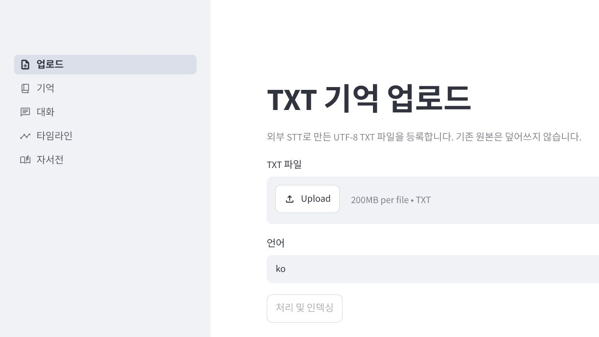
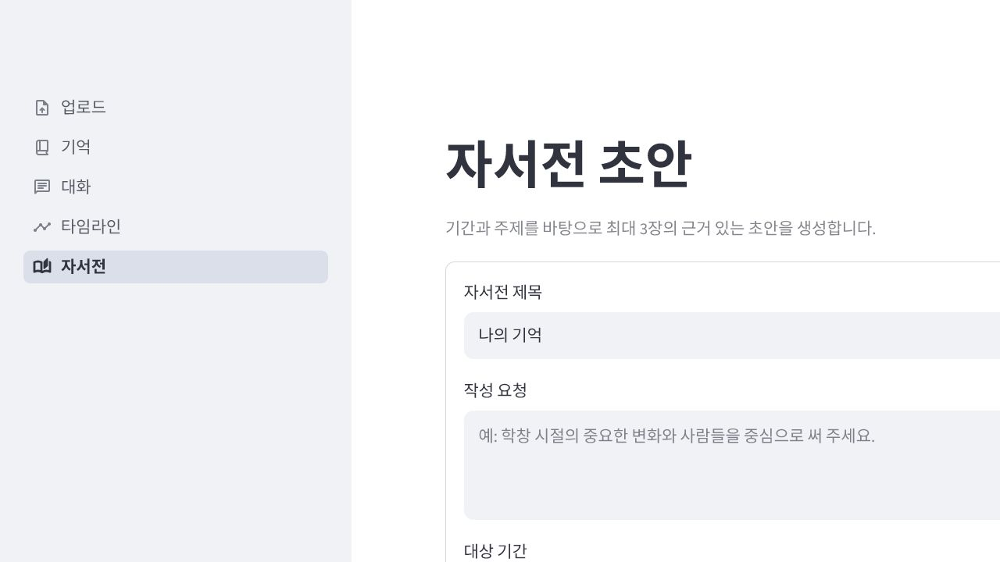
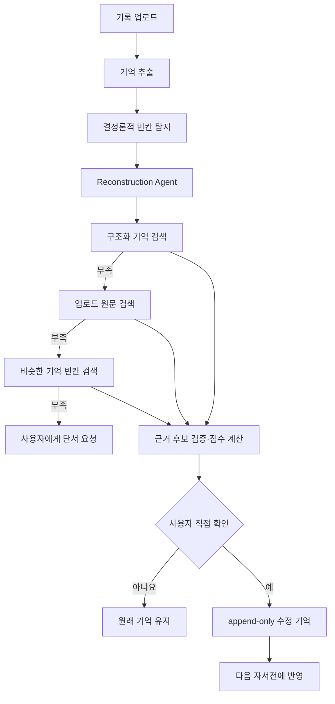
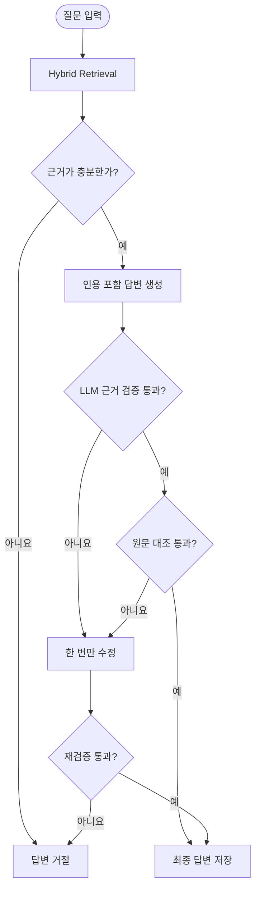
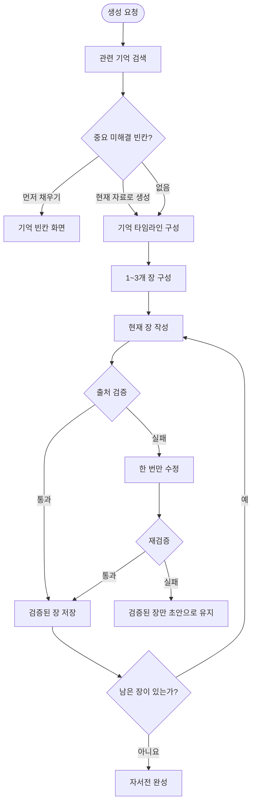

# 기억함 (Life Archive AI)

> 흩어진 삶의 기억들을 검색 가능한 장기 기억으로 정리하는 Memory-Centric RAG

사람의 기억은 날짜와 순서가 흐릿하고 대화 속 여러 장소에 흩어져있습니다. 일반적인 문서 검색형 RAG는 관련 문장을 찾는 데 집중하지만,
기억함은 STT 대화 기록에서 사건을 구조화하여 지속적으로 검색할 수 있는 기억 저장소를 만드는 데 초점을 뒀습니다.

기억함은 외부 STT로 만든 UTF-8 TXT 또는 텍스트 레이어가 있는 PDF를 입력받아
인물, 장소, 날짜, 감정, 불확실성과 원문 위치를 가진 기억으로 변환합니다. 질문
답변, 타임라인, 자서전은 저장된 기억만 근거로 만들며 결과에 출처를 포함합니다.

## 포트폴리오 요약

기억함은 LLM에게 문서를 요약시키는 데모가 아니라, **근거를 추적할 수 있는 장기 기억 저장소와 검증형 에이전트 워크플로**를 구현한 프로젝트입니다.

- SQLite를 기준 저장소로 두고 ChromaDB·BM25는 재생성 가능한 검색 인덱스로 분리했습니다.
- QA와 자서전 생성은 검색 → 생성 → 검증 → 제한적 재작성으로 경계를 둬, 근거 없는 답변을 저장하지 않도록 했습니다.
- 기억의 빈칸은 별도 레코드로 탐지하고, Agent가 내부 기억·원문을 찾아 후보만 제시합니다. 사용자가 직접 확인한 후보만 append-only 수정 기억으로 반영합니다.
- 원본 보존, 인용 위치, 정정 이력, 삭제 후 인덱스 정리와 재시도까지 테스트해 데이터 수명주기를 다뤘습니다.

## 핵심 원칙

- 원본 TXT/PDF는 업로드 후 변경하거나 덮어쓰지 않습니다.
- SQLite만 영구적인 기준 저장소로 사용합니다.
- ChromaDB와 BM25는 SQLite에서 다시 만들 수 있는 검색 인덱스입니다.
- 기록에서 확인되지 않는 날짜, 이름, 대화는 추측하지 않습니다.
- 생성 답변과 자서전에는 SQLite 원문 위치로 연결되는 출처가 필요합니다.
- 업로드 기록 안의 지시문은 데이터로만 취급하고 실행하지 않습니다.

## 주요 기능

| 기능 | 설명 |
|---|---|
| TXT/PDF 업로드 | STT 기록 또는 텍스트 PDF를 불변 원본으로 저장하고 중복 업로드를 차단 |
| 기억 추출 | 인물·장소·날짜·감정·신뢰도·불확실성·근거 위치를 구조화 |
| 하이브리드 검색 | Chroma 의미 검색과 BM25 결과를 RRF로 결합. 점수를 정규화해 더하지 않고 순위만 사용해 두 검색기의 스케일 차이를 피함 |
| 근거 기반 질문 답변 | 검색된 기억만 사용하고 주장별 인용을 검증 |
| 기억 정정 | 원본을 지우지 않고 대체 기억을 덧붙임. 원본의 근거 위치를 승계하고, 타임라인·검색·자서전은 정정본만 사용 |
| 기억 빈칸 복원 | 장소·인물·날짜·충돌·약한 근거를 탐지하고 실제 Tool Calling으로 내부 기억·업로드 원문을 단계 검색. 근거와 일치하는 후보만 사용자에게 제시 |
| 사용자 승인 Guard | LLM에는 쓰기 도구를 주지 않고, 후보 ID와 명시적 동의가 있을 때만 correction·candidate·gap 상태를 한 transaction으로 반영 |
| 타임라인 | 날짜 정밀도를 보존해 정렬하고 날짜 미상 기억을 분리 |
| 자서전 | 관련 기억으로 최대 3개 장을 계획·작성·검증·저장 |
| 개인정보 보호 삭제 | SQLite 기록을 논리 삭제하고 검색 인덱스를 정리 |
| 안전한 오류 처리 | 공통 오류 응답, 요청 ID, 비밀값 마스킹 로그 제공 |

## 검색 설정에 대해

서비스는 하이브리드 검색(Chroma + BM25 + RRF)을 사용합니다. 다만 `reports/experiment_summary.md`의
소규모 합성 데이터 실험에서는 하이브리드가 단일 검색기보다 느리기만 했고 품질 이득은 없었습니다.
어휘가 어긋나는 질의가 거의 없는 조건이라 결합의 이점이 드러나지 않았다고 보고, 실제 기록에서
표현이 다른 질의가 들어올 것을 전제해 하이브리드를 유지했습니다. 실제 임베딩 모델로 교체한 뒤
같은 실험을 다시 돌려 이 판단을 확인하는 것이 다음 과제입니다.

그 실험에서 확인된 것은 검색기 선택보다 **청크 크기의 영향이 훨씬 크다**는 점이었습니다.
1024자에서 256자로 줄이자 인용 정확도가 0.250에서 0.750으로 올랐고, 근거 없는 답변 비율은
0.750에서 0.250으로 떨어졌습니다. (질의 8건, 합성 데이터셋 기준)

## 시스템 아키텍처


LangGraph는 근거 기반 QA, 자서전 생성과 읽기 전용 기억 복원 Agent에
사용합니다. 업로드, 청킹, CRUD, 인덱싱, 빈칸 탐지와 타임라인 정렬은 일반
Python 서비스입니다.

## 기술 스택

| 구분 | 기술 |
|---|---|
| Language | Python 3.13 |
| Frontend | Streamlit |
| Backend | FastAPI, Uvicorn, HTTPX |
| AI | OpenAI API, LangChain v1, LangGraph |
| Storage | SQLite, ChromaDB |
| Retrieval | BM25, Similarity, MMR, Reciprocal Rank Fusion |
| Validation | Pydantic v2 |
| Testing | pytest |
| Environment | Windows PowerShell |

## 화면

아래 화면은 개인정보가 없는 빈 로컬 환경에서 촬영했습니다.





## 프로젝트 구조

```text
life-archive-ai/
├─ backend/app/
│  ├─ api/          # FastAPI 라우터
│  ├─ core/         # 설정, 오류 처리, 안전한 로그
│  ├─ models/       # Pydantic 입출력 모델
│  ├─ prompts/      # 추출·QA·자서전 프롬프트
│  ├─ services/     # 비즈니스 로직과 LangGraph
│  └─ storage/      # SQLite 스키마와 저장소
├─ frontend/        # Streamlit 앱과 typed HTTP client
├─ data/            # raw, processed, db, indexes, exports
├─ docs/            # 설계·API·개인정보 보호 문서
├─ reports/         # 합성 데이터 평가 결과
├─ scripts/         # 실행·데이터 검사·평가 스크립트
└─ tests/           # 단위·통합·UI 테스트
```
## 에이전트 흐름도

### 사용자 승인형 기억 복원


```mermaid
flowchart TD
    UPLOAD[기록 업로드] --> EXTRACT[기억 추출]
    EXTRACT --> DETECT[결정론적 빈칸 탐지]
    DETECT --> AGENT[Reconstruction Agent]
    AGENT --> MEMORY[구조화 기억 검색]
    MEMORY -->|부족| DOCUMENT[업로드 원문 검색]
    DOCUMENT -->|부족| GAPS[비슷한 기억 빈칸 검색]
    GAPS -->|부족| CLUE[사용자에게 단서 요청]
    MEMORY --> CANDIDATE[근거 후보 검증·점수 계산]
    DOCUMENT --> CANDIDATE
    GAPS --> CANDIDATE
    CANDIDATE --> CONFIRM{사용자 직접 확인}
    CONFIRM -- 아니요 --> KEEP[원래 기억 유지]
    CONFIRM -- 예 --> CORRECT[append-only 수정 기억]
    CORRECT --> AUTOBIO[다음 자서전에 반영]
```

모델은 검색 도구만 선택합니다. 서버가 도구 순서·호출 횟수와 exact quote를
검증하며 `resolve`는 모델 도구가 아닙니다. 현재 MVP에는 웹 검색 도구가 없고
내부 SQLite 기억과 업로드 원문만 사용합니다.

### 근거 기반 질문 답변


```mermaid
flowchart TD
    START([질문 입력]) --> RETRIEVE[Hybrid Retrieval]
    RETRIEVE --> CHECK{근거가 충분한가?}

    CHECK -- 아니요 --> REJECT[답변 거절]
    CHECK -- 예 --> GENERATE[인용 포함 답변 생성]

    GENERATE --> VERIFY{LLM 근거 검증 통과?}
    VERIFY -- 예 --> GROUND{원문 대조 통과?}
    VERIFY -- 아니요 --> REWRITE[한 번만 수정]

    GROUND -- 예 --> FINAL[최종 답변 저장]
    GROUND -- 아니요 --> REWRITE

    REWRITE --> VERIFY2{재검증 통과?}
    VERIFY2 -- 예 --> FINAL
    VERIFY2 -- 아니요 --> REJECT
```

질문 답변 에이전트는 다음 원칙을 따릅니다.

* ChromaDB 의미 검색과 BM25 검색 결과를 RRF로 결합합니다.
* 선택된 기억에 포함되지 않은 `memory_id`는 인용할 수 없습니다.
* 생성된 주장마다 하나 이상의 기억 출처가 필요합니다.
* LLM 검증이 통과시킨 답변도 원문 대조를 한 번 더 거칩니다. 주장에 등장하는
  숫자와 인물 이름은 인용된 기억의 필드와 `memory_sources` offset으로 잘라낸
  전사 원문에 실제로 있어야 하며, 없으면 LLM 판정과 무관하게 거부됩니다.
* 인용된 기억의 원문을 찾을 수 없으면(세그먼트 삭제 등) 검증에 실패합니다.
* 검증 실패 시 답변을 한 번만 수정합니다.
* 재검증도 실패하면 생성된 초안을 사용자에게 반환하지 않습니다.

### 자서전 생성


```mermaid
flowchart TD
    START([생성 요청]) --> RETRIEVE[관련 기억 검색]
    RETRIEVE --> GAP{중요 미해결 빈칸?}
    GAP -- 먼저 채우기 --> GAPUI[기억 빈칸 화면]
    GAP -- 현재 자료로 생성 --> TIMELINE[기억 타임라인 구성]
    GAP -- 없음 --> TIMELINE
    TIMELINE --> PLAN[1~3개 장 구성]
    PLAN --> WRITE[현재 장 작성]
    WRITE --> VERIFY{출처 검증}

    VERIFY -- 통과 --> SAVE[검증된 장 저장]
    VERIFY -- 실패 --> REVISE[한 번만 수정]
    REVISE --> VERIFY2{재검증}

    VERIFY2 -- 통과 --> SAVE
    VERIFY2 -- 실패 --> DRAFT[검증된 장만 초안으로 유지]
    SAVE --> NEXT{남은 장이 있는가?}
    NEXT -- 예 --> WRITE
    NEXT -- 아니요 --> COMPLETE[자서전 완성]
```

## 로컬 생성 모델

기본 생성 모델은 Ollama의 `gemma4:e2b`입니다. 설치와 환경 설정은
[로컬 LLM 실행 안내](docs/LOCAL_LLM.md)를 참고하세요. 검색 임베딩은
기존 OpenAI 모델을 유지하므로 API 키가 여전히 필요합니다.

## 설치

Python 3.13과 Windows PowerShell을 기준으로 합니다.

```powershell
git clone https://github.com/nnieun/life-archive-ai.git
Set-Location life-archive-ai
python -m venv .venv
.\.venv\Scripts\Activate.ps1
python -m pip install --upgrade pip
python -m pip install -e ".[dev]"
Copy-Item .env.example .env
```

`.env`의 `OPENAI_API_KEY`에 본인의 키를 입력합니다. `.env`, SQLite DB,
Chroma 인덱스와 실제 개인 TXT는 Git에 추가하지 않습니다.

## 실행

첫 번째 PowerShell에서 백엔드를 실행합니다.

```powershell
.\scripts\run_backend.ps1
```

- 상태 확인: `http://127.0.0.1:8000/api/v1/health`
- OpenAPI UI: `http://127.0.0.1:8000/docs`

두 번째 PowerShell에서 프론트엔드를 실행합니다.

```powershell
.\scripts\run_frontend.ps1
```

브라우저에서 `http://localhost:8501`에 접속합니다.

## 테스트

```powershell
.\.venv\Scripts\python.exe -m pytest
```

테스트는 임시 SQLite와 Chroma 저장소, 가짜 임베딩과 가짜 LLM 출력을
사용하며 실제 OpenAI 호출이나 개인 데이터를 요구하지 않습니다.

## 평가

```powershell
.\.venv\Scripts\python.exe scripts\run_evaluation.py
```

합성 기억 12개와 질문 8개를 사용해 256/512/1024자 청킹,
alias 기준선·MMR·BM25·Hybrid 검색, Top-K 3/5/10을 비교했습니다. 서비스의 실제 검색 경로는
Chroma 의미 검색과 BM25를 RRF로 결합하는 Hybrid입니다.

| 최고 관측 설정 | 결과 |
|---|---:|
| Chunk | `256` |
| Search | `alias` (평가 전용 결정적 기준선) |
| Top-K | `3` |
| Recall@K | `1.000` |
| Citation correctness | `0.750` |
| Unsupported answer rate | `0.250` |

최고 수치는 작은 합성 말뭉치에서 가짜 임베딩과 결정적 답변 시뮬레이터를 사용한
MVP 비교 결과입니다. `alias`는 실제 임베딩 검색이 아니므로 운영 환경의 정확도를
의미하지 않으며, 실제 임베딩 모델과 장기 기록 데이터셋으로 재평가해야 합니다.
이번 기준선에서는 1024자에서 256자로 줄일 때 인용 정확도가 0.250에서 0.750으로
개선됐고, Hybrid는 단일 검색기보다 약 2~3배 느렸지만 품질 이득은 관찰되지 않았습니다.
전체 결과와 한계는
[평가 요약](reports/experiment_summary.md)에서 확인할 수 있습니다.

실제 의미 검색을 평가하려면 `.env`에 `OPENAI_API_KEY`를 설정한 뒤 별도 명령을 실행합니다.
이 명령은 OpenAI 임베딩 API를 호출하므로 비용이 발생하며, 결과는
`reports/real_retrieval_results.csv`와 `reports/real_evaluation_manifest.json`에 저장됩니다.

```powershell
python scripts\\run_real_evaluation.py
```

## 데이터와 개인정보

- 업로드 원본: `data/raw/transcripts/` — 불변이며 Git에서 제외
- SQLite: `data/db/` — 기준 데이터, Git에서 제외
- Chroma: `data/indexes/chroma/` — 재생성 가능, Git에서 제외
- 삭제 API는 애플리케이션 접근을 차단하지만 raw 파일을 자동 삭제하지 않음
- 로그에는 원문, 질문, 개인정보, 로컬 경로와 API 키를 기록하지 않음

자세한 내용은 [개인정보 보호 정책](docs/PRIVACY.md)과
[오류 처리 정책](docs/ERROR_HANDLING.md)을 참고하세요.

## 한계와 향후 개선

- STT, 음성 인식, OCR, 이미지·영상 처리는 범위 밖입니다.
- 로컬 단일 사용자 MVP이며 인증과 사용자별 권한이 없습니다.
- OpenAI API 비용, 네트워크 지연과 모델 가용성의 영향을 받습니다.
- 기억 복원은 내부 기록 우선 MVP입니다. 웹 검색과 외부 자료 provenance,
  Hugging Face 임베딩 비교, 운영 tracing은 후속 범위입니다.
- 현재 평가는 작은 합성 데이터셋과 결정적 기준선을 사용했으며 실제 임베딩과 장기 기록 평가가 필요합니다.
- raw 원본의 물리 삭제와 보존 기간 관리는 사용자가 직접 수행해야 합니다.
- 향후 음성 업로드, 관계·지식 그래프, 다중 사용자, 클라우드 배포를
  추가할 수 있습니다.

## 문서

- [프로젝트 계획](docs/PROJECT_PLAN.md)
- [요구사항](docs/REQUIREMENTS.md)
- [아키텍처](docs/ARCHITECTURE.md)
- [데이터 모델](docs/DATA_MODEL.md)
- [ERD](docs/ERD.md)
- [API 명세](docs/API_SPEC.md)
- [기억 빈칸 탐지·복원 설계](docs/MEMORY_RECONSTRUCTION.md)
- [개인정보 보호](docs/PRIVACY.md)
- [TASK 목록](docs/TASK_LIST.md)
