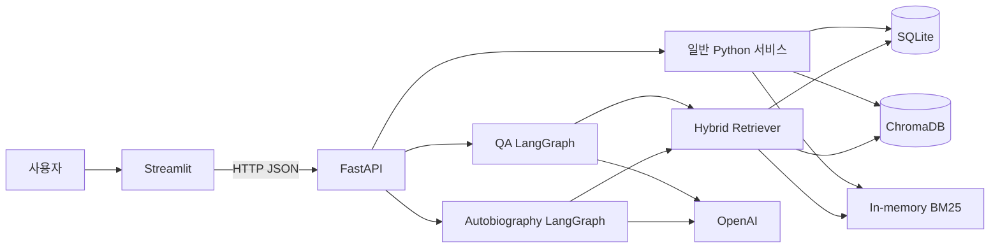
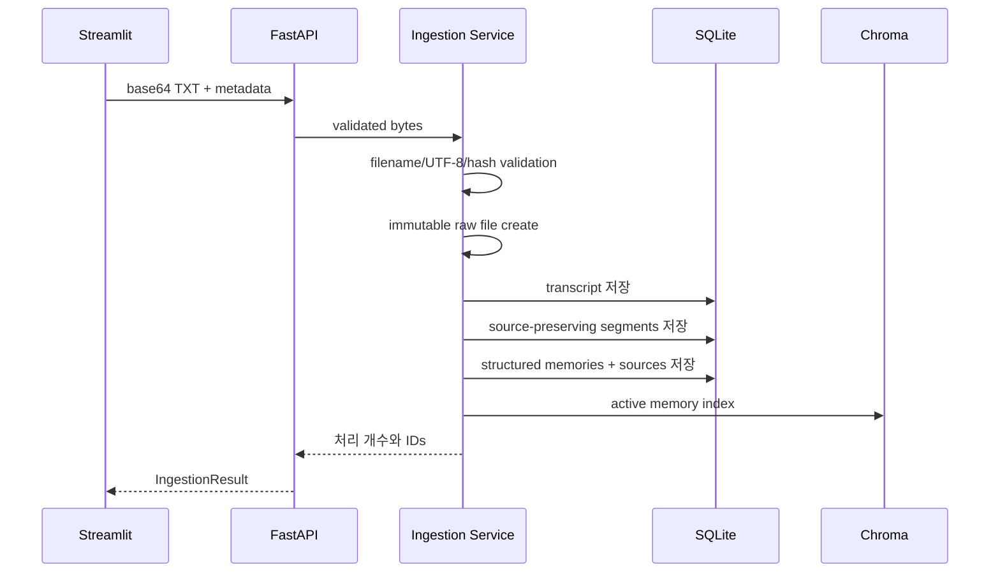
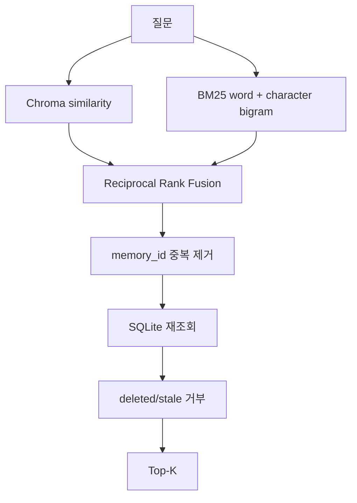
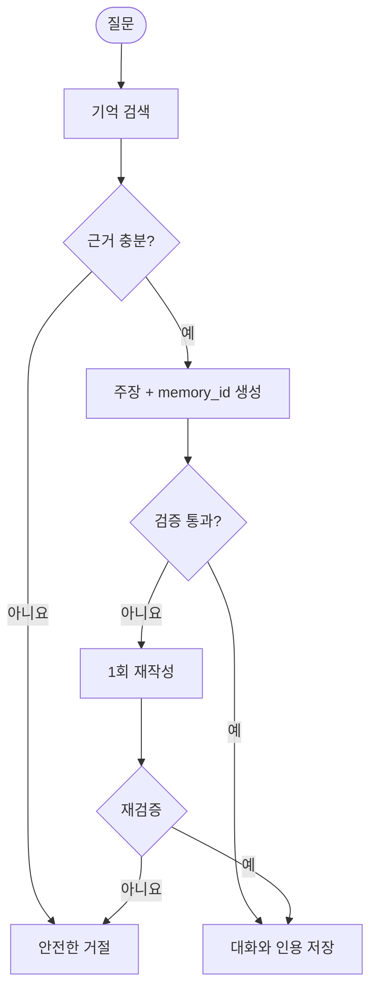
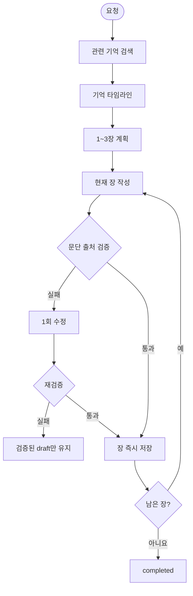
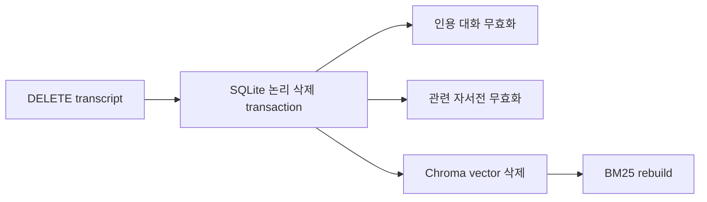

# Life Archive AI 아키텍처

## 1. 시스템 구성



SQLite는 transcript, segment, memory, source, conversation과 autobiography의
유일한 기준 저장소다. Chroma와 BM25는 삭제 후 재구성 가능한 인덱스다.

## 2. 계층과 폴더

```text
backend/app/
├─ api/       FastAPI 요청 검증과 HTTP 응답
├─ core/      환경 설정, 공통 오류, 요청 ID, 안전한 JSON 로그
├─ models/    서비스·그래프 입출력 Pydantic 모델
├─ prompts/   extraction, QA, autobiography 프롬프트
├─ services/  ingestion, retrieval, QA, timeline, autobiography, privacy
└─ storage/   SQLite 연결, 스키마, repository

frontend/
├─ app.py       Streamlit navigation
├─ api_client.py
├─ ui.py
└─ pages/       upload, memories, chat, timeline, autobiography
```

Streamlit은 백엔드 서비스나 저장소를 직접 import하지 않고 typed HTTP
client로 FastAPI만 호출한다.

## 3. 수집 흐름



파일명 또는 내용 해시가 중복되면 `409`를 반환한다. 세그먼트와 기억의
offset은 normalized transcript 기준 반열림 범위다.

## 4. 검색



Similarity와 MMR 실험도 지원한다. 서로 다른 점수 척도를 직접 더하지 않고
순위 기반 RRF를 사용한다.

## 5. QA LangGraph



모델은 strict Pydantic Structured Output을 반환한다. 애플리케이션은
선택되지 않은 `memory_id`를 거부하고 SQLite `memory_sources`로 실제
인용을 만든다. transcript는 escaped JSON 안의 신뢰하지 않는 데이터로
전달된다.

## 6. 타임라인

타임라인은 LangGraph와 LLM을 사용하지 않는다. 활성·수정 기억을 SQLite에서
읽어 날짜의 지원 범위를 계산하고, 누락된 월·일을 만들지 않은 채 정렬한다.
알 수 없거나 해석할 수 없는 날짜는 `undated_events`로 반환한다.

## 7. 자서전 LangGraph



검증되지 않은 장은 저장하지 않고, 앞서 통과한 장은 SQLite draft에
유지한다.

## 8. 저장소

### SQLite

- 원본·정규화 transcript와 metadata
- transcript segments
- structured memories와 memory sources
- conversation sessions/messages와 citations
- autobiography draft/completed content

foreign key를 항상 활성화하고 repository transaction으로 원자성을
보장한다.

### ChromaDB

- ID: SQLite `memory_id`
- document: memory title + summary
- metadata: `memory_id`, `embedding_version`, `content_hash`

검색 hit은 항상 SQLite에서 재조회한다. 내용 hash나 embedding version이
달라지면 다시 인덱싱하고 삭제된 SQLite 기억의 vector는 제거한다.

### BM25

활성 기억의 제목·요약을 단어와 문자 bigram으로 토큰화하는 메모리 내
인덱스다. SQLite에서 rebuild할 수 있다.

## 9. 개인정보 삭제



raw 파일은 불변 정책에 따라 API가 삭제하지 않는다.

## 10. 오류와 로그

모든 HTTP 오류는 `code`, 사용자 안전 메시지와 `request_id`를 포함한다.
동일한 ID를 `X-Request-ID` 응답 헤더로 반환한다. JSON 로그에는 메서드,
라우트 템플릿, 상태 코드, 시간, 요청 ID와 예외 타입만 기록하고 원문,
질문, query 값, 로컬 경로, API 키나 stack trace는 기록하지 않는다.

## 11. API

| Method | Path | 역할 |
|---|---|---|
| GET | `/api/v1/health` | 상태 확인 |
| POST | `/api/v1/memories/ingest` | TXT 수집·추출·색인 |
| GET | `/api/v1/memories` | 활성 기억과 출처 조회 |
| POST | `/api/v1/chat` | 근거 기반 QA |
| POST | `/api/v1/timeline` | 날짜순 기억 조회 |
| POST | `/api/v1/autobiographies` | 자서전 생성 |
| GET | `/api/v1/autobiographies/{autobiography_id}` | 저장 결과 조회 |
| DELETE | `/api/v1/transcripts/{transcript_id}` | 애플리케이션 논리 삭제 |

세부 형식은 [API_SPEC.md](API_SPEC.md)를 따른다.
