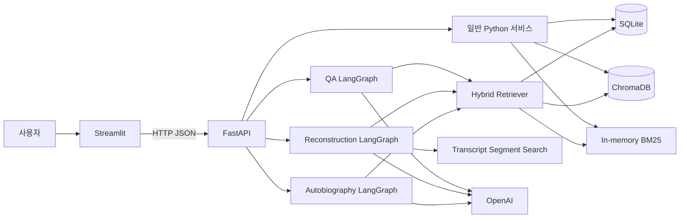
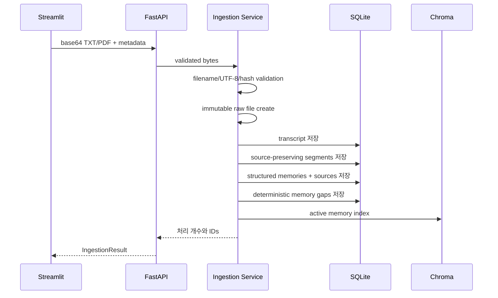
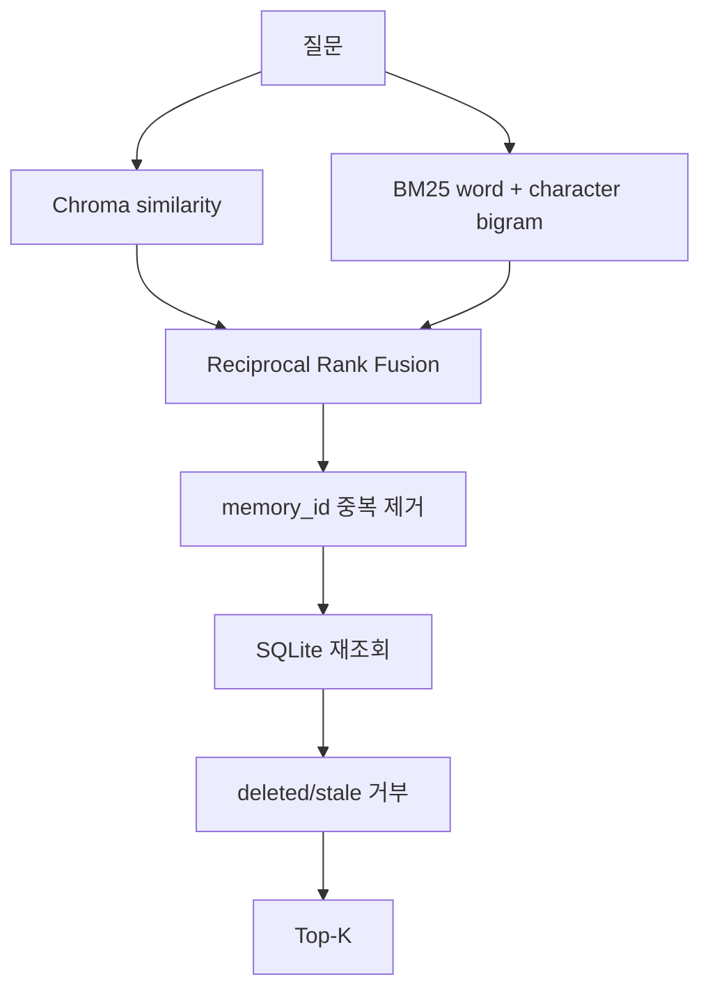
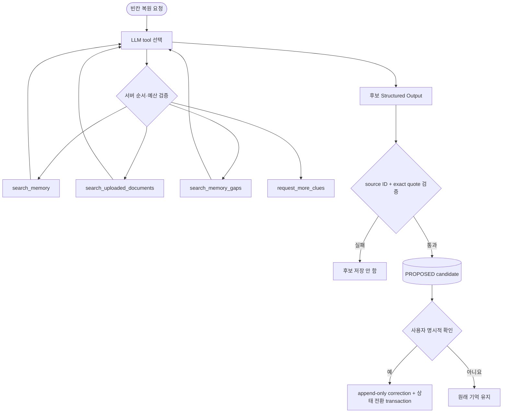
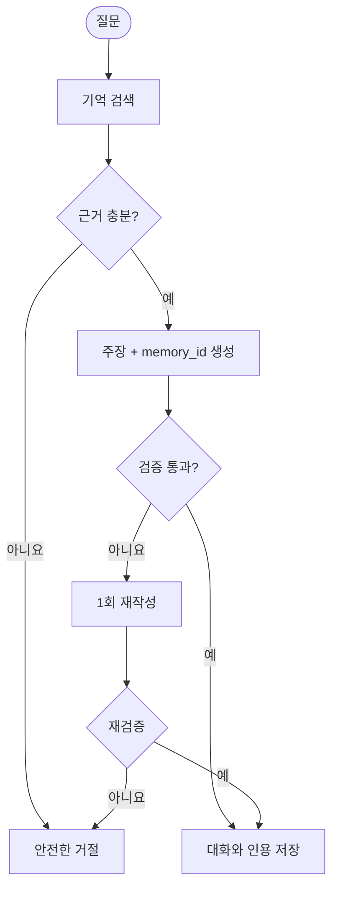
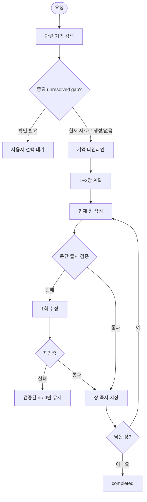
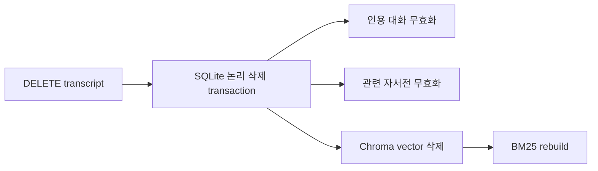

# Life Archive AI 아키텍처

## 1. 시스템 구성


```mermaid
flowchart LR
    User[사용자] --> UI[Streamlit]
    UI -->|HTTP JSON| API[FastAPI]
    API --> Services[일반 Python 서비스]
    API --> QA[QA LangGraph]
    API --> RG[Reconstruction LangGraph]
    API --> AB[Autobiography LangGraph]
    Services --> DB[(SQLite)]
    Services --> Chroma[(ChromaDB)]
    Services --> BM25[In-memory BM25]
    QA --> Retriever[Hybrid Retriever]
    RG --> Retriever
    RG --> Documents[Transcript Segment Search]
    AB --> Retriever
    Retriever --> DB
    Retriever --> Chroma
    Retriever --> BM25
    QA --> OpenAI[OpenAI]
    RG --> OpenAI
    AB --> OpenAI
```

SQLite는 transcript, segment, memory, source, memory gap, candidate,
conversation과 autobiography의 유일한 기준 저장소다. Chroma와 BM25는
삭제 후 재구성 가능한 인덱스다.

## 2. 계층과 폴더

```text
backend/app/
├─ api/       FastAPI 요청 검증과 HTTP 응답
├─ core/      환경 설정, 공통 오류, 요청 ID, 안전한 JSON 로그
├─ models/    서비스·그래프 입출력 Pydantic 모델
├─ prompts/   extraction, gap reconstruction, QA, autobiography 프롬프트
├─ services/  ingestion, gap, retrieval, QA, timeline, autobiography, privacy
└─ storage/   SQLite 연결, 스키마, repository

frontend/
├─ app.py       Streamlit navigation
├─ api_client.py
├─ ui.py
└─ pages/       upload, memories, gaps, chat, timeline, autobiography
```

Streamlit은 백엔드 서비스나 저장소를 직접 import하지 않고 typed HTTP
client로 FastAPI만 호출한다.

## 3. 수집 흐름


```mermaid
sequenceDiagram
    participant UI as Streamlit
    participant API as FastAPI
    participant I as Ingestion Service
    participant DB as SQLite
    participant C as Chroma

    UI->>API: base64 TXT/PDF + metadata
    API->>I: validated bytes
    I->>I: filename/UTF-8/hash validation
    I->>I: immutable raw file create
    I->>DB: transcript 저장
    I->>DB: source-preserving segments 저장
    I->>DB: structured memories + sources 저장
    I->>DB: deterministic memory gaps 저장
    I->>C: active memory index
    I-->>API: 처리 개수와 IDs
    API-->>UI: IngestionResult
```

파일명 또는 내용 해시가 중복되면 `409`를 반환한다. 세그먼트와 기억의
offset은 normalized transcript 기준 반열림 범위다.

## 4. 검색


```mermaid
flowchart TD
    Q[질문] --> Dense[Chroma similarity]
    Q --> Sparse[BM25 word + character bigram]
    Dense --> RRF[Reciprocal Rank Fusion]
    Sparse --> RRF
    RRF --> Dedup[memory_id 중복 제거]
    Dedup --> Reload[SQLite 재조회]
    Reload --> Guard[deleted/stale 거부]
    Guard --> TopK[Top-K]
```

Similarity와 MMR 실험도 지원한다. 서로 다른 점수 척도를 직접 더하지 않고
순위 기반 RRF를 사용한다.

## 5. 기억 복원 LangGraph


```mermaid
flowchart TD
    START([빈칸 복원 요청]) --> AGENT[LLM tool 선택]
    AGENT --> POLICY{서버 순서·예산 검증}
    POLICY --> M[search_memory]
    M --> AGENT
    POLICY --> D[search_uploaded_documents]
    D --> AGENT
    POLICY --> G[search_memory_gaps]
    G --> AGENT
    POLICY --> Q[request_more_clues]
    AGENT --> C[후보 Structured Output]
    C --> V{source ID + exact quote 검증}
    V -- 실패 --> STOP[후보 저장 안 함]
    V -- 통과 --> P[(PROPOSED candidate)]
    P --> H{사용자 명시적 확인}
    H -- 예 --> TX[append-only correction + 상태 전환 transaction]
    H -- 아니요 --> KEEP[원래 기억 유지]
```

모델은 네 개의 읽기 전용 도구만 호출할 수 있다. `resolve`는 Tool Calling에
노출하지 않으며 FastAPI 입력과 서버 Guard를 통과해야 한다. 자세한 경계는
[MEMORY_RECONSTRUCTION.md](MEMORY_RECONSTRUCTION.md)에 정리한다.

## 6. QA LangGraph


```mermaid
flowchart TD
    START([질문]) --> RETRIEVE[기억 검색]
    RETRIEVE --> ASSESS{근거 충분?}
    ASSESS -- 아니요 --> REJECT[안전한 거절]
    ASSESS -- 예 --> GENERATE[주장 + memory_id 생성]
    GENERATE --> VERIFY{검증 통과?}
    VERIFY -- 예 --> SAVE[대화와 인용 저장]
    VERIFY -- 아니요 --> REWRITE[1회 재작성]
    REWRITE --> VERIFY2{재검증}
    VERIFY2 -- 예 --> SAVE
    VERIFY2 -- 아니요 --> REJECT
```

모델은 strict Pydantic Structured Output을 반환한다. 애플리케이션은
선택되지 않은 `memory_id`를 거부하고 SQLite `memory_sources`로 실제
인용을 만든다. transcript는 escaped JSON 안의 신뢰하지 않는 데이터로
전달된다.

## 7. 타임라인

타임라인은 LangGraph와 LLM을 사용하지 않는다. 활성·수정 기억을 SQLite에서
읽어 날짜의 지원 범위를 계산하고, 누락된 월·일을 만들지 않은 채 정렬한다.
알 수 없거나 해석할 수 없는 날짜는 `undated_events`로 반환한다.

## 8. 자서전 LangGraph


```mermaid
flowchart TD
    START([요청]) --> RETRIEVE[관련 기억 검색]
    RETRIEVE --> GAP{중요 unresolved gap?}
    GAP -- 확인 필요 --> STOPGAP[사용자 선택 대기]
    GAP -- 현재 자료로 생성/없음 --> TIMELINE[기억 타임라인]
    TIMELINE --> PLAN[1~3장 계획]
    PLAN --> WRITE[현재 장 작성]
    WRITE --> VERIFY{문단 출처 검증}
    VERIFY -- 실패 --> REVISE[1회 수정]
    REVISE --> VERIFY2{재검증}
    VERIFY2 -- 실패 --> STOP[검증된 draft만 유지]
    VERIFY -- 통과 --> SAVE[장 즉시 저장]
    VERIFY2 -- 통과 --> SAVE
    SAVE --> NEXT{남은 장?}
    NEXT -- 예 --> WRITE
    NEXT -- 아니요 --> COMPLETE[completed]
```

검증되지 않은 장은 저장하지 않고, 앞서 통과한 장은 SQLite draft에
유지한다. 현재 자료로 생성을 선택해도 미확인 candidate 값, 인용 Memory에
없는 숫자와 불확실성 표현 없는 날짜 충돌은 Python 검증에서 거부한다.

## 9. 저장소

### SQLite

- 원본·정규화 transcript와 metadata
- transcript segments
- structured memories와 memory sources
- memory gaps와 reconstruction candidates
- conversation sessions/messages와 citations
- autobiography draft/completed content

foreign key를 항상 활성화하고 repository transaction으로 원자성을
보장한다.

### ChromaDB

- ID: SQLite `memory_id`
- document: memory title + summary
- metadata: `memory_id`, `embedding_version`, `content_hash`

검색 hit은 항상 SQLite에서 재조회한다. 내용 hash나 embedding version이
달라지면 다시 인덱싱하고 삭제된 SQLite 기억의 vector는 제거한다.

### BM25

활성 기억의 제목·요약을 단어와 문자 bigram으로 토큰화하는 메모리 내
인덱스다. SQLite에서 rebuild할 수 있다.

## 10. 개인정보 삭제


```mermaid
flowchart LR
    D[DELETE transcript] --> TX[SQLite 논리 삭제 transaction]
    TX --> MSG[인용 대화 무효화]
    TX --> BIO[관련 자서전 무효화]
    TX --> V[Chroma vector 삭제]
    V --> B[BM25 rebuild]
```

raw 파일은 불변 정책에 따라 API가 삭제하지 않는다.

## 11. 오류와 로그

모든 HTTP 오류는 `code`, 사용자 안전 메시지와 `request_id`를 포함한다.
동일한 ID를 `X-Request-ID` 응답 헤더로 반환한다. JSON 로그에는 메서드,
라우트 템플릿, 상태 코드, 시간, 요청 ID와 예외 타입만 기록하고 원문,
질문, query 값, 로컬 경로, API 키나 stack trace는 기록하지 않는다.

## 12. API

| Method | Path | 역할 |
|---|---|---|
| GET | `/api/v1/health` | 상태 확인 |
| POST | `/api/v1/memories/ingest` | TXT/PDF 수집·추출·색인 |
| GET | `/api/v1/memories` | 활성 기억과 출처 조회 |
| GET | `/api/v1/memory-gaps` | 활성 기억 빈칸과 후보 조회 |
| POST | `/api/v1/memory-gaps/{gap_id}/reconstruct` | 내부 기록 Tool Calling 복원 |
| POST | `/api/v1/memory-gaps/{gap_id}/resolve` | 사용자 확인 후보 반영 |
| POST | `/api/v1/chat` | 근거 기반 QA |
| POST | `/api/v1/timeline` | 날짜순 기억 조회 |
| POST | `/api/v1/autobiographies` | 자서전 생성 |
| POST | `/api/v1/autobiographies/gap-check` | 관련 중요 빈칸 사전 확인 |
| GET | `/api/v1/autobiographies/{autobiography_id}` | 저장 결과 조회 |
| DELETE | `/api/v1/transcripts/{transcript_id}` | 애플리케이션 논리 삭제 |

세부 형식은 [API_SPEC.md](API_SPEC.md)를 따른다.
