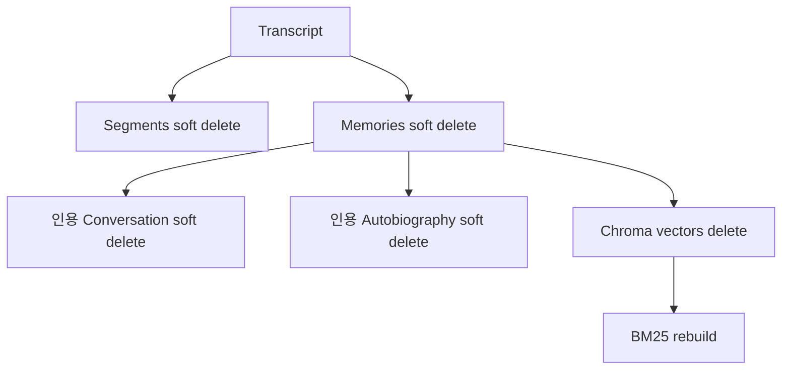

# Life Archive AI 데이터 모델

## 1. 저장 원칙

SQLite는 유일한 Source of Truth다. ChromaDB와 BM25는 활성 SQLite
기억으로 다시 만들 수 있는 검색 인덱스이며 비즈니스 데이터의 영구
저장소가 아니다.

## 2. Transcript

외부 STT가 만든 업로드 기록이다.

| 필드 | 타입 | 설명 |
|---|---|---|
| `transcript_id` | str | `tr_` 기반 결정적 ID |
| `filename` | str | 안전한 TXT 파일명 |
| `recording_id` | str \| null | 선택적 외부 녹음 ID |
| `language` | str \| null | 언어 metadata |
| `source_type` | str | 입력 유형 |
| `uploaded_at` | datetime | 업로드 시각 |
| `recorded_at` | datetime \| null | 녹음 시각, 사건 날짜로 사용하지 않음 |
| `content_hash` | str | 중복 방지 SHA-256 |
| `raw_content` | str | UTF-8로 decode한 원문 |
| `normalized_content` | str | 후속 처리용 정규화 본문 |
| `created_at`, `updated_at`, `deleted_at` | datetime | 수명주기 |

raw 파일은 `data/raw/transcripts`에 불변으로 저장되며 SQLite의
`raw_content`도 normalized content와 분리된다.

## 3. Transcript Segment

| 필드 | 타입 | 규칙 |
|---|---|---|
| `segment_id` | str | PK |
| `transcript_id` | str | transcript FK |
| `chunk_index` | int | transcript 내 0부터 시작, unique |
| `content` | str | 정규화 본문의 해당 slice |
| `start_offset` | int | 포함 시작점 |
| `end_offset` | int | 제외 끝점 |

항상 다음을 만족해야 한다.

```python
segment.content == transcript.normalized_content[
    segment.start_offset:segment.end_offset
]
```

기본 청커는 고정 문자 크기와 overlap을 사용하며 token 단위도 지원한다.
이벤트 인식 청킹은 평가 후보이며 수집 시 사건을 임의로 추론하지 않는다.

## 4. Memory

대화에서 추출한 사건 단위 기억이다.

| 필드 | 타입 | 설명 |
|---|---|---|
| `memory_id` | str | PK |
| `transcript_id` | str | 원본 transcript FK |
| `title` | str | 짧은 사건 제목 |
| `summary` | str | 근거 범위 안의 요약 |
| `people` | list[str] | 확인된 사람 |
| `location` | str \| null | 확인된 장소 |
| `event_date` | str \| null | 원문 정밀도를 유지한 날짜 |
| `date_precision` | enum | exact/day/month/year/approximate/unknown |
| `emotion` | str \| null | 확인된 감정 |
| `confidence` | float | 0.0~1.0 |
| `uncertainty_notes` | str \| null | 낮은 신뢰도나 모호성 |
| `status` | enum | active/corrected/deleted |
| `supersedes_memory_id` | str \| null | 수정으로 대체한 기억 |

`event_date`가 null이면 `date_precision`은 `unknown`이어야 한다. 모델이
반환한 segment 내부 evidence offset을 검증한 뒤 절대 transcript offset으로
변환하여 memory와 source를 한 transaction에 저장한다.

## 5. Memory Source와 Citation

기억과 원문 구간의 연결이다.

```python
class CitationRecord:
    memory_id: str
    transcript_id: str
    segment_id: str | None
    start_offset: int
    end_offset: int
```

`memory_sources`에는 별도 `memory_source_id`와 timestamps가 추가된다.
모든 offset은 normalized transcript의 반열림 범위다.

## 6. Conversation

`conversation_sessions`:

- `session_id`, `title`
- `created_at`, `updated_at`, `deleted_at`

`conversation_messages`:

- `message_id`, `session_id`
- `role`: system/user/assistant
- `content`
- `citations_json`: Pydantic으로 검증되는 citation 목록
- timestamps와 `deleted_at`

삭제된 기억을 인용한 message는 개인정보 삭제 흐름에서 논리 삭제된다.

## 7. Timeline

Timeline은 별도 영구 테이블이 아니라 현재 SQLite memory에서 계산되는
응답 모델이다.

```python
class TimelineEvent:
    memory_id: str
    transcript_id: str
    title: str
    description: str
    event_date: str | None
    date_precision: DatePrecision
    date_label: str
    people: list[str]
    location: str | None
    emotion: str | None
    confidence: float
    uncertainty_notes: str | None
    status: MemoryStatus
    citations: list[CitationRecord]
```

`TimelineResult`는 `events`, `undated_events`, 선택적 `start_date`,
`end_date`를 포함한다.

## 8. Autobiography

`autobiographies` 테이블:

| 필드 | 설명 |
|---|---|
| `autobiography_id` | PK |
| `title` | 사용자 제목 |
| `content_json` | 최대 3개의 typed chapter |
| `status` | draft/completed/deleted |
| timestamps | 생성·수정·논리 삭제 |

각 chapter는 `title`, `content`, `citations`를 가진다. 생성 시작 시 빈
draft를 저장하고, 검증된 장만 누적 저장하며 요청한 모든 장이 통과하면
`completed`가 된다.

## 9. Chroma 모델

```text
id: memory_id
document: memory.title + memory.summary
embedding: embedding provider output
metadata:
  memory_id
  embedding_version
  content_hash
```

사람, 장소, 날짜와 같은 비즈니스 metadata는 Chroma를 기준으로 읽지
않는다. 검색 결과는 `memory_id`와 distance를 사용해 SQLite에서 현재
MemoryRecord를 다시 불러온다.

## 10. 삭제 수명주기



raw 파일은 이 흐름에서 수정하거나 삭제하지 않는다.
