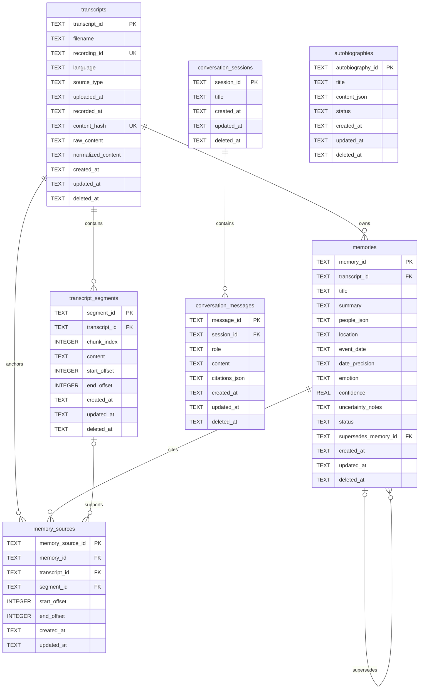

# Life Archive AI ERD

SQLite만 관계형 Source of Truth다. ChromaDB와 BM25는 재생성 가능한
인덱스이므로 ERD에서 제외한다. 대화와 자서전의 인용은 JSON으로 저장되어
논리적 관계만 가진다.

## 무결성 규칙

- 모든 SQLite 연결에서 `PRAGMA foreign_keys = ON`을 확인한다.
- transcript `content_hash`는 unique이며 내용 중복을 차단한다.
- `(transcript_id, chunk_index)`는 unique다.
- offset은 음수가 아니며 `end_offset >= start_offset`이다.
- segment content는 normalized transcript의 반열림 source slice와 같다.
- JSON TEXT는 SQLite `json_valid`와 Pydantic 양쪽에서 검증한다.
- memory 상태는 `active`, `corrected`, `deleted`로 제한한다.
- 날짜 정밀도는 `exact`, `day`, `month`, `year`, `approximate`,
  `unknown`으로 제한한다.
- 날짜가 없으면 정밀도는 `unknown`, 날짜가 있으면 `unknown`이 아니어야 한다.
- memory와 memory source는 evidence 검증 후 원자적으로 저장한다.
- `uploaded_at`/`recorded_at`은 transcript metadata이며 memory
  `event_date`를 대신하지 않는다.

## 삭제 동작

애플리케이션 삭제는 transcript, segment, memory, 인용 conversation
message와 autobiography를 soft delete한다. 관련 Chroma vector를 삭제하고
BM25를 다시 만든다. 향후 명시적 hard delete가 수행될 경우를 위해 SQLite
foreign-key cascade가 관계 무결성을 보호한다. raw 파일은 자동 변경하거나
삭제하지 않는다.
