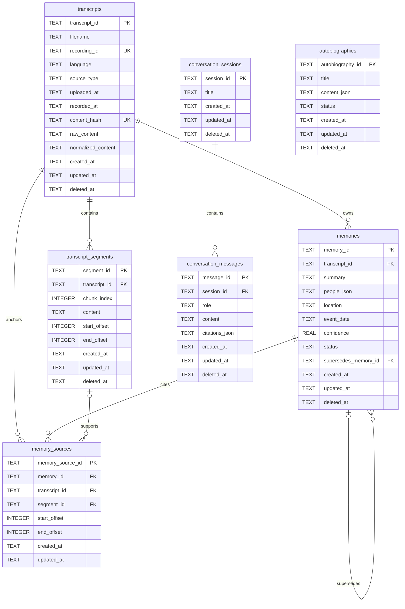

# Life Archive AI ERD

SQLite is the only source of truth. ChromaDB is a rebuildable retrieval index
and is intentionally absent from this relational model.

## Integrity Rules

- Every SQLite connection enables `PRAGMA foreign_keys = ON`.
- Transcript `content_hash` is unique and prevents duplicate ingestion.
- Segment indexes are unique within a transcript.
- Offsets are non-negative and `end_offset >= start_offset`.
- JSON values are stored as TEXT, checked with SQLite `json_valid`, and validated
  with Pydantic before writes and after reads.
- Memory status is restricted to `active`, `corrected`, or `deleted`.
- Deleted memories are hidden by default and retained for traceability.
- `uploaded_at` and `recorded_at` belong to transcripts; `event_date` belongs to
  memories. They are never substituted for one another.
- Creation and modification timestamps use timezone-aware ISO 8601 values.

## Deletion Behavior

Application CRUD uses soft deletion for transcripts, segments, memories,
conversation sessions, messages, and autobiographies. Foreign-key cascade rules
protect consistency if a future administrative hard deletion is explicitly
performed. Raw transcript files are never changed or deleted automatically.
