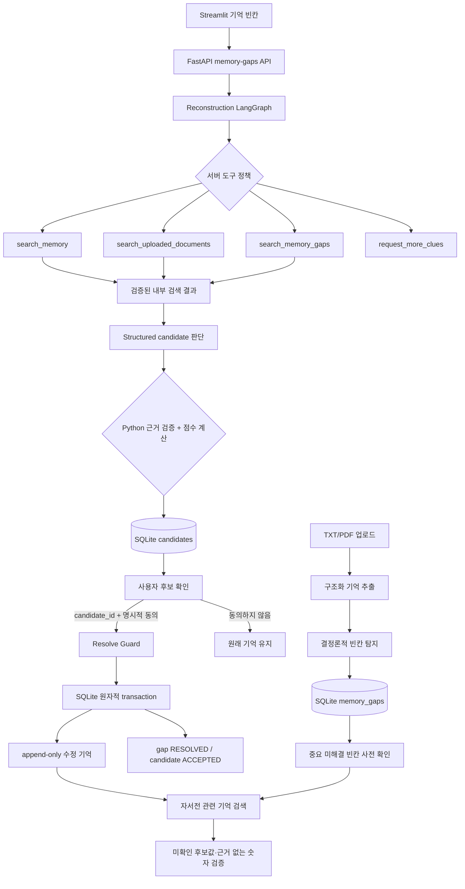
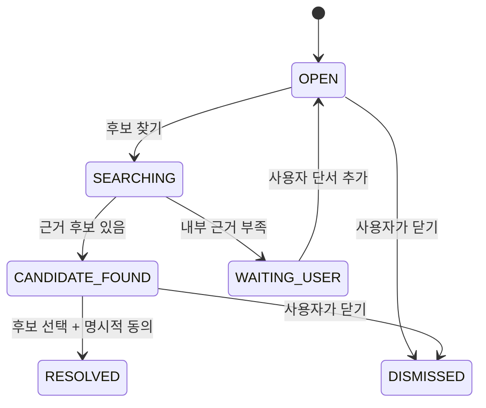

# 기억 빈칸 탐지·복원 설계

## 1. 해결하려는 문제

과거 기록에는 “극장 이름은 기억나지 않는다”, “정확한 날짜는 모르겠다”처럼
사건은 있지만 일부 정보가 비어 있는 경우가 많다. 사용자가 흩어진 파일을 직접
검색하고 자서전을 다시 고치는 반복 작업을 줄이기 위해 다음 수직 흐름을 구현했다.

```text
업로드 → 기억 추출 → 빈칸 탐지 → 내부 근거 검색 → 후보 제안
      → 사용자 확인 → append-only 수정 기억 → 다음 자서전에 반영
```

이번 MVP는 내부 기억, 업로드 원문, 다른 기억 빈칸만 검색한다. 원본 기획의 웹
검색, Hugging Face 임베딩 비교, Langfuse 관측성은 이 흐름이 안정화된 뒤의
확장 범위이며 현재 구현에 포함되지 않는다.

## 2. 전체 구조



## 3. 탐지 규칙

`MemoryGapDetectionService`는 LLM을 호출하지 않고 검증된 Memory 필드와
보수적인 문구 패턴만 사용한다. 모든 모호성을 빈칸으로 만들지 않는다.

| 유형 | 사용자 표시 의미 | 대표 조건 |
|---|---|---|
| `MISSING_LOCATION` | 정확한 장소가 비어 있음 | 장소 이름을 기억하지 못한다는 명시적 표현 |
| `MISSING_PERSON` | 함께 있던 사람이 비어 있음 | 사람 맥락은 있지만 이름이 없음 |
| `MISSING_DATE` | 언제였는지가 비어 있음 | 날짜 미상 또는 대략적 날짜 |
| `UNCERTAIN_EVENT` | 사건 내용 확인 필요 | 낮은 신뢰도·명시적 불확실성 |
| `CONFLICTING_FACT` | 서로 다른 기록 확인 필요 | 같은 사건 제목에 서로 다른 날짜 |
| `WEAK_PROVENANCE` | 뒷받침 기록 필요 | 단일 출처이며 중간 신뢰도 |

`gap_id`는 memory ID, 유형, 누락 필드로 만든 안정적인 hash라 같은 수집을
재시도해도 같은 빈칸이 중복 저장되지 않는다. 탐지는 원래 Memory를 수정하지
않는다.

## 4. Tool Calling 정책

OpenAI 모델에는 네 개의 읽기 전용 도구만 bind한다. LLM이 실제 tool call을
선택하지만 서버가 다음 순서를 검증하고, 한 응답에서 병렬 호출을 허용하지
않는다.

1. `search_memory`
2. `search_uploaded_documents` — 기억만으로 부족할 때
3. `search_memory_gaps` — 앞선 두 검색으로 부족할 때
4. `request_more_clues` — 모든 내부 근거가 부족할 때

최대 Tool call 수와 추가 단서 요청 횟수가 정해져 있다. 도구를 건너뛰거나
반복하거나 여러 개를 동시에 호출하면 실행 전에 중단한다. 쓰기·resolve·웹
검색 도구는 모델에 제공하지 않는다.

전사 원문과 빈칸 문구는 모두 신뢰하지 않는 데이터로 경계 처리한다. 파일의
로컬 경로는 도구 결과에 포함하지 않는다.

## 5. 후보 근거와 점수

후보 모델은 엄격한 Structured Output으로 `value`, `evidence_text`, 관계,
설명과 내부 source ID를 반환한다. Python은 저장 전에 다음을 다시 확인한다.

- source ID가 이번 Tool 결과 안에 있는가
- `evidence_text`가 해당 source content의 정확한 연속 부분 문자열인가
- `value`가 `evidence_text`의 정확한 연속 부분 문자열인가
- 같은 값이 중복 제안되지 않았는가

LLM이 점수를 정하지 않는다. 서버가 다음 식으로 0~1 점수를 계산한다.

```text
score = search_score * 0.50
      + date_overlap * 0.20
      + location_match * 0.15
      + people_match * 0.10
      + event_match * 0.05
```

점수는 정렬과 사용자 판단 보조용이며 자동 확정 기준이 아니다.

## 6. 사용자 확인과 원자적 반영

`MemoryGapResolutionService.resolve`는 Agent tool 목록에 없다. FastAPI가 받은
실제 `candidate_id`와 `user_confirmed=true`가 모두 있어야 호출된다.

Resolve Guard는 다음을 검사한다.

- gap과 candidate가 존재하고 아직 닫히지 않았는가
- candidate가 해당 gap 소속이며 `PROPOSED`인가
- 내부 supporting source가 실제로 존재하는가
- 외부 근거라면 별도 동의가 있는가
- 대상 필드에 안전하게 적용할 수 있는 값인가

반영할 때 원래 Memory 행을 덮어쓰지 않는다. 기존 정정 서비스와 동일하게 새
`CORRECTED` Memory와 상속한 source를 만들고 `supersedes_memory_id`로 연결한다.
새 기억, 후보 `ACCEPTED`, 다른 후보 `REJECTED`, gap `RESOLVED` 전환은 하나의
SQLite transaction에서 처리된다. 중간 실패 시 모두 rollback된다.

## 7. 자서전 연동

자서전 생성 전에는 검색된 기억과 연결된 활성 빈칸 중
`importance_score >= 0.65`인 항목만 다시 제안한다. 모든 빈칸을 반복해서
보여 주지 않는다.

사용자는 다음 중 하나를 선택한다.

- `기억을 먼저 채우기`: 기억 빈칸 화면으로 이동
- `현재 자료로 생성`: 미확인 세부사항을 만들지 않는다는 안내에 동의하고 생성

두 번째 경우 unresolved gap을 계획·작성·검증 프롬프트에 전달한다. 또한
Python 검증이 아직 `PROPOSED` 또는 `REJECTED`인 후보값을 문단에서 발견하면
LLM 검증 결과와 무관하게 실패시키고 한 번만 수정한다. 인용된 Memory에 없는
숫자와, 날짜 충돌을 불확실성 표현 없이 단정한 문장도 거부한다.

사용자가 후보를 확인하면 append-only 수정 기억이 활성 검색 결과가 되고 gap은
`RESOLVED`가 된다. 다음 자서전은 기존 기억 대신 수정 기억을 검색하므로 확인된
내용이 별도 수작업 없이 반영된다.

## 8. 상태 흐름



## 9. API

| Method | Path | 역할 |
|---|---|---|
| `GET` | `/api/v1/memory-gaps` | 활성 빈칸과 후보 목록 |
| `GET` | `/api/v1/memory-gaps/{gap_id}` | 빈칸 상세 |
| `POST` | `/api/v1/memory-gaps/{gap_id}/reconstruct` | 내부 Tool Calling 검색 |
| `POST` | `/api/v1/memory-gaps/{gap_id}/clues` | 사용자 단서 추가 |
| `POST` | `/api/v1/memory-gaps/{gap_id}/resolve` | 명시적 동의 후보 반영 |
| `POST` | `/api/v1/memory-gaps/{gap_id}/dismiss` | 빈칸 닫기 |
| `POST` | `/api/v1/autobiographies/gap-check` | 관련 중요 빈칸 사전 확인 |

## 10. 오류 진단

| 오류 코드 | 의미 | 확인할 곳 |
|---|---|---|
| `memory_gap_tool_policy_violation` | 모델이 검색 순서를 위반 | Agent tool call 순서·중복 |
| `memory_gap_candidate_output_invalid` | 후보가 Tool 근거와 불일치 | source ID, exact quote, value |
| `memory_gap_model_unavailable` | OpenAI 모델 호출 실패 | `.env`, 네트워크, 모델 가용성 |
| `memory_gap_search_unavailable` | 내부 검색 도구 실패 | SQLite·Chroma·BM25 상태 |
| `memory_gap_confirmation_required` | 실제 사용자 동의 없음 | resolve 요청의 확인 값 |
| `memory_gap_candidate_source_invalid` | 후보 근거가 없거나 허용되지 않음 | source 삭제·외부 동의 |
| `memory_gap_target_changed` | 확인 전에 원래 기억이 별도 수정됨 | 최신 Memory에서 다시 탐지 |
| `memory_gap_resolution_unsupported` | 후보를 대상 필드에 안전하게 적용 불가 | 날짜 형식·누락 필드 |

각 오류 응답에는 요청 ID가 포함된다. 로그에는 전사 원문, 후보값, 로컬 경로나
API 키를 기록하지 않는다.

## 11. 검증 범위

테스트는 실제 OpenAI 호출 없이 fake Tool Calling 메시지와 Structured Output을
사용한다. 다음 경계를 회귀 검증한다.

- 탐지 idempotency와 과잉 탐지 방지
- Tool 순서·호출 예산·내부 검색 우선
- Tool 근거에 없는 후보 저장 거부
- 사용자 확인 전 Memory 불변
- correction과 상태 전환의 원자성
- unresolved 후보의 자서전 사용 차단
- resolved 수정 기억의 다음 자서전 반영
- 업로드 원본 bytes 불변
