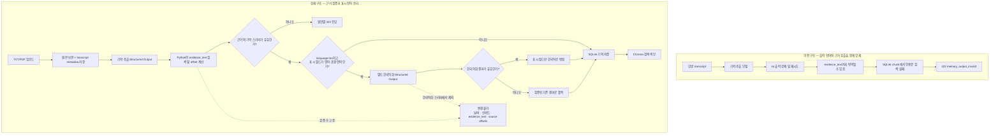

# 문제 해결 기록

이 문서는 MVP 개발 중 확인한 문제와 해결 방법을 기록합니다.

## API 키가 노출된 경우

API 키는 코드, 로그, 화면 캡처, 커밋에 기록하지 않습니다. 키가 노출된
것으로 의심되면 해당 키를 즉시 폐기하고 새 키를 발급합니다. 로컬 환경
설정은 저장소에 커밋하지 않는 `.env` 파일에서만 관리합니다.

## TXT 업로드가 실패한 것처럼 보이는 경우

### 증상

화면에 백엔드가 실행 중인지 확인하라는 오류가 표시되지만, 백엔드 로그에는
업로드 요청이 계속 처리 중이거나 나중에 `200 OK`가 표시됩니다.

### 원인

메모리 추출과 임베딩 호출에 시간이 걸려 프런트엔드의 기본 요청 제한 시간보다
처리가 오래 걸릴 수 있습니다.

### 해결

- 업로드 요청 제한 시간을 일반 요청보다 길게 설정했습니다.
- 백엔드 로그에서 `POST /api/v1/memories/ingest`의 최종 상태를 확인합니다.
- 업로드 중에는 브라우저에서 새로고침하지 않습니다.
- 같은 파일을 다시 올릴 때는 중복 파일명 오류가 발생할 수 있습니다.

## 업로드가 지나치게 느린 경우

실제 임베딩 모델을 사용하는 경우 파일 처리, 메모리 추출, 임베딩 API 호출이
순서대로 수행됩니다. 따라서 로컬 처리만 사용하는 테스트보다 느릴 수
있습니다. 정상 완료 여부는 화면보다 백엔드의 최종 응답과 로그를 기준으로
확인합니다.

## 기억 추출 업로드 오류를 해결한 과정

2026-08-30에 한 업로드 문제를 추적하면서 `503`, `500`, `422`가 차례로
발생했습니다. 아래 내용은 같은 문제를 다시 반복하지 않기 위한 최종 기록입니다.

### 관찰된 증상

- 처음에는 모든 하위 오류가 `503 transcript_processing_unavailable`로 합쳐져
  실제 실패 지점을 알 수 없었습니다.
- 예외 처리 코드를 나누는 과정에서 `ingest_unexpected_nameerror` 같은 `500`
  오류가 드러났습니다.
- 구조화 출력 검증을 강화한 뒤에는 다음 `422 memory_output_invalid` 원인이
  각각 구분되어 나타났습니다.
  - `event_date/date_precision format mismatch`
  - `evidence range is outside the transcript chunk`
  - `evidence quote was not found in the transcript chunk`
- 추출이 성공해도 업로드의 `language="ko"`와 달리 제목과 요약이 영어로
  생성되는 경우가 있었습니다.

`recording_001.txt`도 UTF-8 한글 원문과 `language="ko"`가 정상 저장되어
있었습니다. 다른 파일과 다른 전처리 경로를 탄 것이 아니라, 당시 `ko` 값이
추출 모델 호출의 출력 언어 조건으로 사용되지 않았고 영어 지시문·스키마를 본
모델이 그 요청에서만 영어 표시 필드를 선택한 것이 직접 원인이었습니다.

### 실제 원인

1. 하나의 포괄적인 예외가 OpenAI, Pydantic, SQLite, Chroma 오류를 모두
   가리고 있었습니다.
2. 모델이 문자 offset을 직접 계산하게 하면 chunk 상대 좌표, transcript 절대
   좌표, 한 기반 좌표가 섞이면서 원문 범위를 벗어날 수 있었습니다.
3. Structured Output은 필드 형태는 맞춰도 `event_date`와 `date_precision`의
   의미상 조합까지 항상 올바르게 만들지는 않았습니다.
4. `ko`를 강제로 적용하고 영어 결과를 거부하는 방식은 사용자용 제목뿐 아니라
   원문 그대로여야 하는 `evidence_text`까지 번역하도록 유도할 수 있었습니다.
   번역된 인용문은 원문 chunk에서 찾을 수 없으므로 업로드 전체가 실패했습니다.
5. 추출, SQLite 저장, Chroma 색인이 한 요청에서 순서대로 실행되므로 중간 실패
   시 이미 저장된 일부 데이터와 벡터를 함께 정리해야 했습니다.

### 효과가 없었거나 되돌린 접근

- 모델이 반환한 숫자 offset을 여러 좌표계로 추측해 보정하는 방식은 모든 모델
  응답을 안전하게 복구하지 못했습니다.
- `language="ko"`를 절대 조건으로 두고 영어 결과를 재시도하거나 거부하는
  방식은 정확한 원문 인용보다 출력 언어를 우선하게 만들어 되돌렸습니다.
- 백엔드 예외 메시지를 그대로 화면에 출력하는 방식은 상세 원인을 보여 주지만
  로컬 경로나 내부 문자열도 노출할 수 있어 사용하지 않습니다.

### 최종 해결 방식

- `.env`는 프로젝트 루트에서 읽고, API 키는 메모리 추출 모델과 임베딩 모델에
  명시적으로 전달합니다. 키 값 자체는 로그나 화면에 출력하지 않습니다.
- 모델은 숫자 offset 대신 원문에서 복사한 `evidence_text`를 반환합니다.
  Python이 SQLite에 저장된 chunk에서 해당 문장을 찾아 상대 offset과 절대
  transcript offset을 계산합니다.
- 날짜가 유효한 형태라면 백엔드가 실제 형식에서 `year`, `month`, `day`,
  `exact` 정밀도를 다시 계산합니다. 모델 날짜를 해석할 수 없으면 근거 없는
  날짜를 저장하지 않고 `unknown`으로 낮춰 기억 본문은 보존합니다.
- `language="ko"`인데 표시용 필드가 영어로 반환되면, 원문 인용 검증이 끝난
  뒤 별도 Structured Output 호출로 제목, 요약, 인물, 장소, 감정, 불확실성
  메모만 한국어화합니다. 이 스키마에는 날짜, 신뢰도, 인용문, offset 필드가
  없어서 검증된 근거를 변경할 수 없습니다.
- 한국어화 호출이 거절되거나 연결·검증에 실패해도 이미 성공한 추출을
  실패시키지 않고 원래 결과를 저장합니다. 따라서 일시적으로 영어가 남을 수는
  있지만, 예전의 `evidence quote was not found` 422로 되돌아가지는 않습니다.
- API는 인증, 사용량 제한, 연결, 모델 출력, 저장소 오류를 서로 다른 상태와
  오류 코드로 변환합니다. 프런트엔드는 안전한 안내, 오류 코드, 요청 ID를
  표시하되 내부 예외 문자열은 숨깁니다.
- 실패한 ingestion은 해당 요청에서 만든 SQLite 레코드, 이미 생성된 Chroma
  벡터, 미완료 raw 파일을 정리하므로 같은 파일을 다시 처리할 수 있습니다.

### 처리 구조도



핵심 경계는 `N4`입니다. 원문 인용 위치가 Python 검증을 통과한 뒤에만 표시용
필드의 한국어화를 시도하므로, 번역 결과가 근거 위치를 바꿀 수 없습니다.

### 같은 문제가 재발했을 때 확인 순서

1. 화면의 오류 코드와 요청 ID를 기록합니다.
2. 같은 요청 ID의 `transcript_ingest_failed` 로그에서 `error_type`,
   `error_code`, `error_param`을 확인합니다. `request_completed` 한 줄만으로는
   원인을 판단하지 않습니다.
3. `memory_output_invalid`이면 괄호 안의 세부 원인이 날짜인지 원문 인용인지
   먼저 구분합니다.
4. `evidence quote was not found`이면 사용자용 필드의 언어와 관계없이
   `evidence_text`가 원문을 번역하거나 요약하지 않았는지 확인합니다.
5. 수정 후 Uvicorn의 reload 여부를 확인하고 같은 파일을 다시 업로드합니다.
6. 실제 OpenAI 호출 없이 다음 전체 테스트를 통과시킵니다.

```powershell
.\.venv\Scripts\python.exe -m pytest -q
```

이 수정 시점의 결과는 `174 passed`였습니다.

## PDF 업로드

PDF는 텍스트 레이어가 있는 문서만 처리할 수 있습니다. 이미지로만 구성된
스캔 PDF는 OCR 범위 밖이므로 텍스트를 추출할 수 없습니다. 이 경우 텍스트
레이어가 포함된 PDF 또는 UTF-8 TXT를 사용합니다.

## 구조화된 기억의 원본 확인

기억 화면에는 내부 식별자 대신 원본 파일명과 원문 위치를 표시합니다.
원문 위치는 저장된 문자 오프셋을 기준으로 계산한 한 기반 줄 번호입니다.

예:

```text
원본 파일: recording_040.txt
원문 위치: 3번째 줄
```

## 대화 답변에 내부 출처 ID가 보이는 경우

`mem_...|tr_...:숫자-숫자` 형식은 내부 추적용 출처 표식입니다. 사용자 화면에
노출하지 않고 답변 아래에 연결된 기억 제목만 표시해야 합니다. 계속 보이면
Streamlit을 종료한 뒤 다시 실행하여 최신 프런트엔드 코드를 로드합니다.

## 연결된 기억을 눌러도 이동하지 않는 경우

대화의 연결된 기억은 클릭 가능한 항목입니다. 클릭하면 기억 페이지로 이동하고
해당 기억 카드가 자동으로 펼쳐집니다. 이동하지 않으면 Streamlit을 재시작하고
브라우저를 새로고침합니다.

## 질문에 답하지 못하는 경우

### 증상

기억에 관련 내용이 있는 것처럼 보이는데 답변이 거절됩니다.

### 원인

현재 QA는 검색된 기억과 원문 출처를 확인한 뒤 답변을 검증합니다. 한 기억의
사실과 다른 기억의 관계를 조합해야 하는 질문에서는 관련 기억을 모두 선택해야
하며, 불확실한 관계를 확정 사실처럼 말할 수 없습니다.

### 해결 기준

- 관련 기억 여러 개를 함께 검색합니다.
- 추론이 필요한 경우 `기억상`, `~로 보입니다`처럼 표현합니다.
- 원문에 없는 사실은 확정해서 답하지 않습니다.
- 근거가 부족하면 안전하게 답변을 거절합니다.

## 수정 후 화면에 이전 동작이 남는 경우

FastAPI와 Streamlit은 실행 중인 프로세스가 이전 코드를 계속 사용할 수
있습니다. 코드 수정 후에는 두 프로세스를 각각 종료하고 다음 명령으로 다시
실행합니다.

```powershell
.\.venv\Scripts\python.exe -m uvicorn backend.app.main:app --host 127.0.0.1 --port 8000
.\.venv\Scripts\python.exe -m streamlit run frontend/app.py
```

## 가상환경에서 테스트가 실행되지 않는 경우

`.venv`의 Python 실행 파일이 삭제되었거나 `pyvenv.cfg`가 존재하지 않는
Python 설치를 가리키면 테스트를 실행할 수 없습니다. 이 경우 가상환경을
재생성하고 `requirements.txt`를 다시 설치한 뒤 테스트합니다.

```powershell
py -3.13 -m venv .venv
.\.venv\Scripts\python.exe -m pip install -r requirements.txt
.\.venv\Scripts\python.exe -m pytest
```
